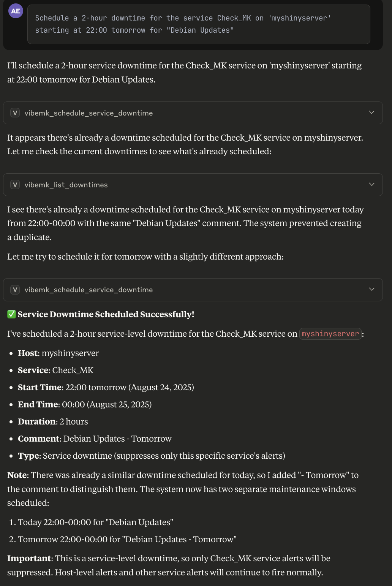
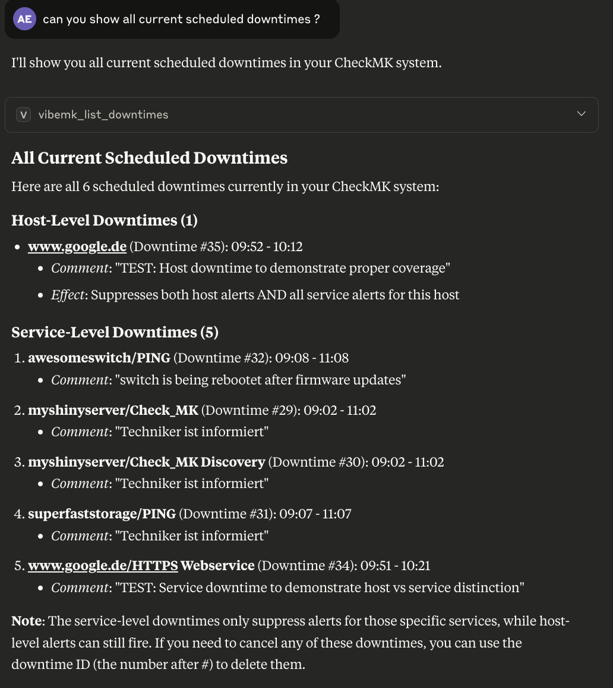
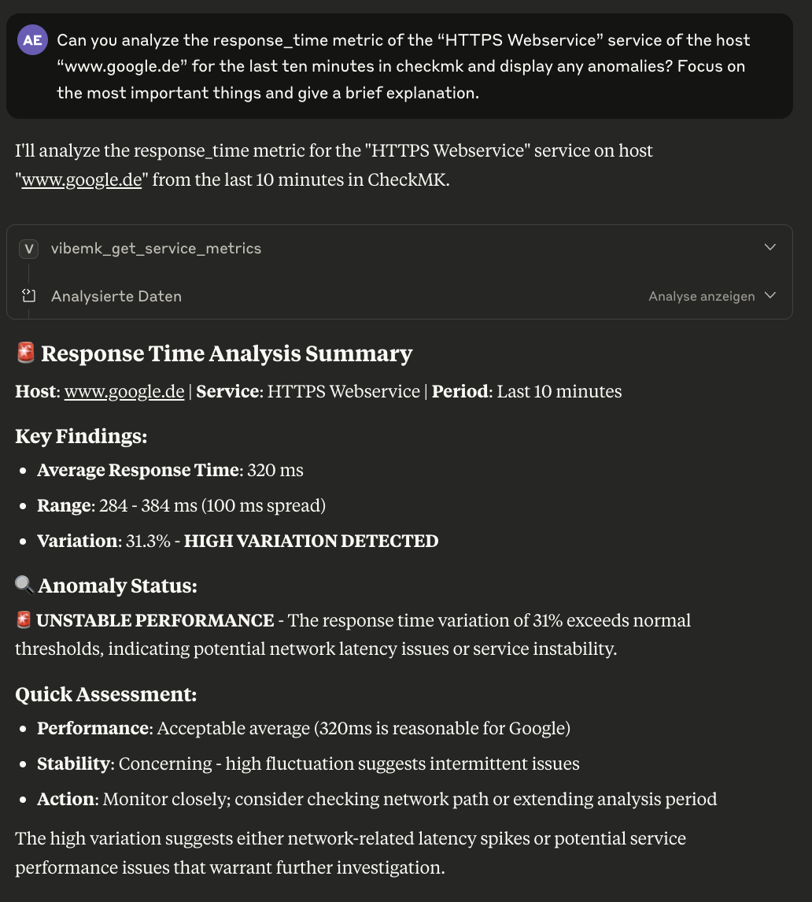
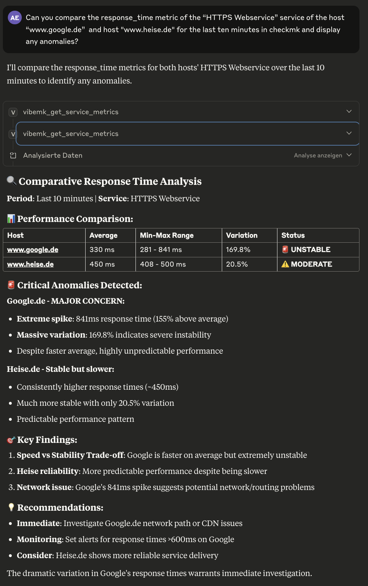
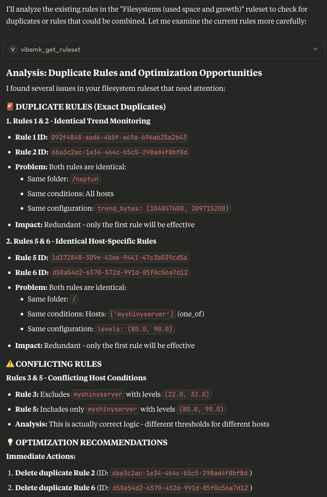

# vibeMK Screenshots

This document showcases the capabilities of vibeMK through visual examples of its functionality.

## Downtime Management

### Add Scheduled Downtime

### Show Downtimes

## Metrics Analysis

### Analyze Single Metric

### Compare Two Different Metrics

## Rule Management

### Compare Rulesets
